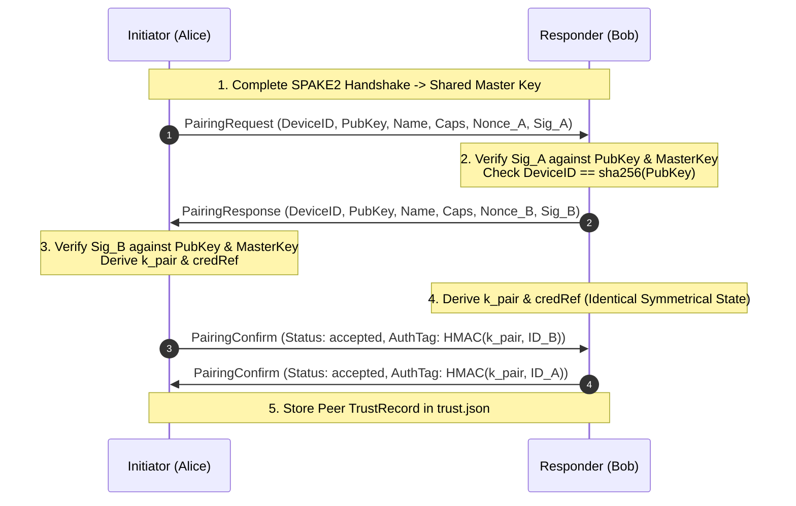

# Trust & Device Identity Model

Scope: SendBeam v1.5 introduces persistent device identity and trusted device mesh capabilities, allowing paired devices to authenticate each other and automate transfers without centralized accounts, global directories, or server-side file persistence.

---

## 1. Cryptographic Device Identity

Every SendBeam client generates and manages an independent, long-term cryptographic identity.

### 1.1 Key Material

- **Algorithm:** Ed25519 (`crypto/ed25519` in Go, `@noble/curves/ed25519` in TypeScript).
- **Public Key:** 32 bytes raw.
- **Private Key:** 32-byte private seed (never transmitted across any network boundary or exported into logs).

### 1.2 Canonical Device Identifier (`DeviceID`)

The `DeviceID` is an immutable, collision-resistant string derived deterministically from the public key:

```
DeviceID = "sb-dev-" || LowercaseHex(SHA-256(RawPublicKey[32]))
```

- **Length:** 71 characters (`sb-dev-` prefix + 64 hex characters).
- **Properties:** Universally unique, content-addressed to the public key, independent of human names or network addresses.

### 1.3 Human-Verifiable Fingerprint

For visual comparison and out-of-band out-of-screen verification:

```
Fingerprint = "SB1-" || FormatBase32_4x4(SHA-256(RawPublicKey[32])[0..10])
```

- **Example:** `SB1-MW3A-M46W-5WEE-X4A4`
- **Properties:** 80 bits of cryptographic pre-image resistance, grouped into 4 uppercase alphanumeric chunks for effortless visual inspection.

---

## 2. Key Storage & Protection

The private seed is protected locally according to the platform's security capabilities:

| Platform        | Storage Mechanism                        | Fallback / Degradation                                                    |
| :-------------- | :--------------------------------------- | :------------------------------------------------------------------------ |
| **macOS**       | Keychain Services / Protected File       | User-confined directory (`~/.config/sendbeam/identity.key`, `0600` perms) |
| **Windows**     | DPAPI / Protected File                   | User app data directory (`%APPDATA%\SendBeam\identity.key`, `0600` ACL)   |
| **Linux / BSD** | Secret Service API / Protected File      | User config directory (`~/.config/sendbeam/identity.key`, `0600` perms)   |
| **Browser**     | IndexedDB / WebCrypto non-exportable key | LocalStorage is strictly refused for raw private keys                     |

Silent downgrade to insecure plaintext persistence is forbidden.

---

## 3. Local Trust Database (`trust.json`)

Paired devices are recorded in a local versioned database containing identity bindings and policy parameters.

### 3.1 Record Schema

```json
{
  "device_id": "sb-dev-65b60673d6ed884bf01c2c222d82ada0740f29ac3355d6a925c81f17f47a27b8",
  "public_key": "79b5562e8fe654f94078b112e8a98ba7901f853ae695bed7e0e3910bad049664",
  "local_label": "Work Laptop (M3 Max)",
  "pair_credential_ref": "cred-78f9a20...",
  "capabilities": ["transfer.v1", "transfer.v2", "lan_direct", "auto_accept"],
  "first_seen_at": "2026-08-21T06:00:00Z",
  "last_seen_at": "2026-08-21T06:45:00Z",
  "revoked": false,
  "revoked_at": null,
  "policy": {
    "auto_accept": true,
    "auto_accept_dest_dir": "/home/user/Downloads/SendBeam",
    "max_file_size_bytes": 10737418240,
    "allowed_mime_types": []
  }
}
```

### 3.2 Atomicity & Concurrency Safety

- Writes use **atomic temporary files and renames** (`trust-*.tmp` → `trust.json`) with restricted permissions (`0600`).
- Process-level mutexes and cooperative file locks prevent concurrent read/write corruptions.

---

## 4. Trust Boundaries & Revocation Semantics

### 4.1 Local Revocation vs. Global Accounts

SendBeam operates strictly without centralized accounts or global directory servers.

- **Local Unpair / Revoke:** Revoking a device removes or marks the local trust record as revoked. Future connection attempts from that device will be rejected immediately during the authenticated handshake.
- **Honest Limitations:** There is no centralized server revocation list (CRL) or account-wide revocation. If Device A revokes Device B, Device A will reject Device B. If Device B still has Device A in its local DB, Device B's attempts to connect to Device A will fail authentication.

### 4.2 Display Names vs. Cryptographic Identity

- **Display labels are strictly local user metadata.** Display names transmitted over the wire are never used as a trust anchor.
- Authentication binds to the `DeviceID` (public key digest) and cryptographic signatures.

---

## 5. Auto-Accept Policy & Confinement

Automated transfers (e.g. CLI daemon or background desktop receiver) require strict safety bounds:

1. **Explicit Opt-in:** `auto_accept` defaults to `false`. It must be explicitly configured per-device.
2. **Absolute Destination Directory:** `auto_accept_dest_dir` must be an absolute path. Setting it to filesystem root (`/` or `C:\`) is strictly rejected.
3. **Path Sanitization:** File names are subject to strict relative path validation (`safe_path.go` / `safe-path.ts`) to prevent directory traversal or symlink escapes outside the designated destination root.
4. **Quota & Size Caps:** Incoming files exceeding `max_file_size_bytes` or available disk headroom abort before writing to disk.

---

## 6. One-Time Pairing Ceremony

The pairing ceremony bootstraps long-term pairwise trust through the existing SPAKE2 authenticated channel without requiring central servers.



### 6.1 Cryptographic Transcript Binding

- **Request Challenge:** `"sendbeam/1 pairing-request:" || SHA-256(MasterKey) || Nonce_A || DeviceID_A`
- **Response Challenge:** `"sendbeam/1 pairing-response:" || SHA-256(MasterKey) || Nonce_A || Nonce_B || DeviceID_B`
- Both signatures are signed with the device's private Ed25519 key.

### 6.2 Pair Credential Derivation (`k_pair`)

```
k_pair = HKDF-SHA256(
    IKM = MasterKey,
    Salt = Nonce_A || Nonce_B,
    Info = "sendbeam/1 pair-credential" || LexicographicalSort(PubKey_A, PubKey_B),
    Length = 32 bytes
)
PairCredentialRef = "cred-" || LowercaseHex(SHA-256(k_pair))
```

### 6.3 Re-Pairing & Conflict Mitigation

- **Legitimate Re-Pairing:** When a known device reconnects with the same cryptographic key, its local label, capabilities, and `LastSeenAt` timestamp are safely updated.
- **Key & Label Conflicts:**
  - If a pairing peer claims an active name already assigned to a different public key, the ceremony aborts with `ErrLabelConflict`.
  - Silent key overwrites are strictly forbidden to prevent impersonation attacks.
