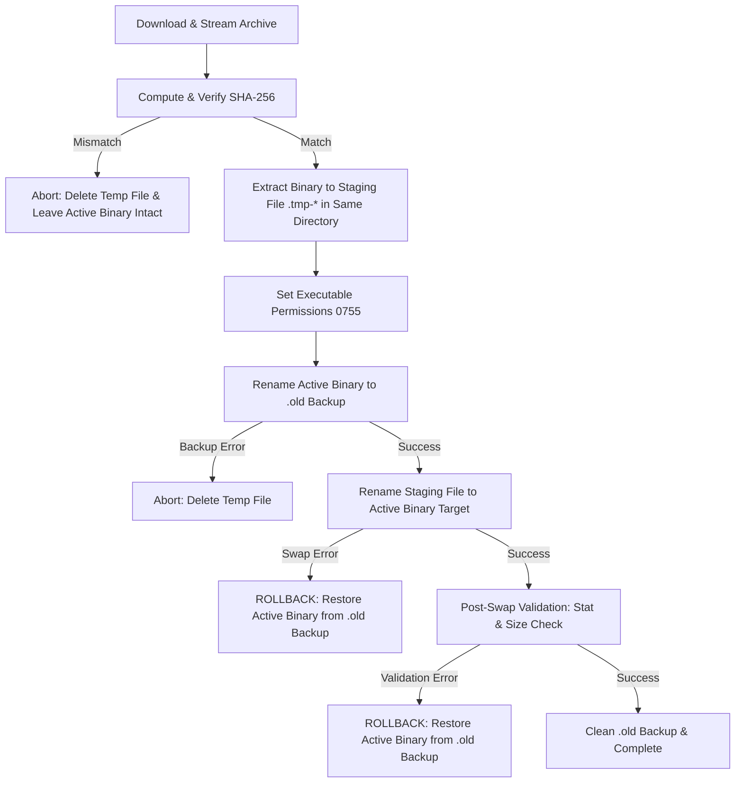

# SendBeam Updater & Rollback Architecture

This document describes SendBeam's self-update engine, distribution channels, cryptographic verification, atomic file replacement, and automatic rollback mechanisms.

---

## 1. Overview

SendBeam provides a framework-independent Go updater engine (`apps/cli/internal/updater`) shared by the CLI (`sendbeam update`) and desktop services. The updater ensures that standalone binaries can safely upgrade without compromising runtime integrity, corrupting active installations, or exposing users to downgrade attacks.

---

## 2. Distribution Channels

SendBeam defines three formal distribution channels:

| Channel                | Description                    | Allowed Release Types                                 | Downgrade / Prerelease Rule                                                        |
| :--------------------- | :----------------------------- | :---------------------------------------------------- | :--------------------------------------------------------------------------------- |
| **`stable`** (Default) | Official production releases.  | Stable releases only (`vX.Y.Z`).                      | **Never** checks or applies prereleases, beta builds, or RC tags.                  |
| **`beta`**             | Early-access candidate builds. | Stable + Prerelease (`vX.Y.Z-beta.N`, `vX.Y.Z-rc.N`). | Tracks both stable and candidate builds.                                           |
| **`dev`**              | Local / development builds.    | Untagged / `dev` versions.                            | Informs user they are on a dev build; automated updates are skipped unless forced. |

---

## 3. Cryptographic Verification & Invariants

1. **Transport Security:** Release metadata and checksum manifests are retrieved exclusively over HTTPS.
2. **Authoritative Hash Verification:** Every downloaded artifact is streamed through a SHA-256 hasher and verified against the canonical checksum manifest (`SHA256SUMS.txt`) before touching the active binary.
3. **Downgrade Rejection:** Candidate versions must be strictly greater than the currently running version according to SemVer 2.0.0 precedence rules. Equal or older versions are rejected.
4. **Platform Matching:** Artifact names are matched strictly against target OS and architecture (`sendbeam-cli-<os>-<arch>.tar.gz` or `.zip`).

---

## 4. Atomic Replacement & Rollback Mechanism

Updating an active executable follows a fail-closed, multi-stage transaction:



### Transaction Steps

1. **Staging:** A temporary file `<target>.tmp-<rand>` is created in the _same_ directory as the target executable, guaranteeing same-filesystem atomic rename operations (`os.Rename`).
2. **Verification:** The archive is decompressed and the binary is extracted into the staging file. If SHA-256 check fails, the staging file is immediately unlinked.
3. **Backup:** The running executable is moved to `<target>.old`.
4. **Atomic Swap:** The staging file is renamed to `<target>`.
5. **Automatic Rollback:** If the atomic swap or post-swap validation fails for any reason, the updater catches the error, restores `<target>.old` back to `<target>`, cleans up temporary files, and returns a rollback error.
6. **Cleanup:** On verified success, the `.old` backup is removed.

---

## 5. CLI Usage

```bash
# Check for updates on the default stable channel:
sendbeam update --check

# Check for updates in machine-readable JSON format:
sendbeam update --check --json

# Check candidate builds on the beta channel:
sendbeam update --check --channel beta

# Download and apply update:
sendbeam update
```

---

## 6. System Package Manager Delegation

When SendBeam is installed via system package managers (e.g. Debian `.deb`, Homebrew, WinGet, or Scoop), updates should be managed through the respective package manager:

- Debian/Ubuntu: `apt update && apt upgrade sendbeam-desktop`
- macOS Homebrew: `brew upgrade sendbeam`
- Windows WinGet: `winget upgrade SendBeam`
